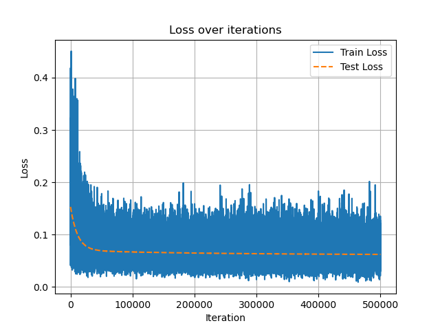
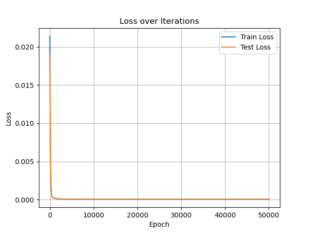

# AI4I Binary Classification Prediction
## linear regression
### my model
linear_model = LinearRegression(n_iter=50000, lr=8e-4, batch_size=64)

**TP: 83  TN: 206  FP: 36  FN: 21**
Accuracy: 0.8352601156069365
Precision: 0.6974789915966386
Recall: 0.7980769230769231
F1 Score: 0.7443946188340808
Total time taken: 38.09750461578369 seconds

 

### sklearn
linear_sklearn = LinearRegression()

**TP: 78  TN: 217  FP: 20  FN: 24**
Accuracy: 0.8702064896755162
Precision: 0.7959183673469388
Recall: 0.7647058823529411
F1 Score: 0.7799999999999999
Total time taken: 5.636926174163818 seconds
 

## perceptron
### my model
perceptron_model = Perceptron(n_iter=50000, lr=2e-3, batch_size=64)

**TP: 102  TN: 242  FP: 44  FN: 21**
Accuracy: 0.8410757946210269
Precision: 0.6986301369863014
Recall: 0.8292682926829268
F1 Score: 0.758364312267658
Total time taken: 19.484343767166138 seconds
 

### sklearn
perceptron_sklearn = Perceptron(max_iter=100000, random_state=42)

**TP: 94  TN: 232  FP: 36  FN: 21**
Accuracy: 0.8511749347258486
Precision: 0.7230769230769231
Recall: 0.8173913043478261
F1 Score: 0.7673469387755102
Total time taken: 2.7166144847869873 seconds
 