# AI4I Binary Classification Prediction

This project applies machine learning to the AI4I 2020 Predictive Maintenance Dataset for predicting machine failures. Models including linear regression, perceptrons, logistic regression, and multi-layer perceptrons were evaluated. The MLP outperformed others with an F1-score of 0.841, effectively handling complex patterns and minimizing false negatives. These results emphasize the potential of machine learning in improving industrial predictive maintenance.

I also write a [report](https://github.com/Wendy-Ying/AI4I-Binary-Classification-Prediction/blob/main/AI4I%20Binary%20Classification%20Prediction%20Report.pdf) about it. There is also a [PPT](https://github.com/Wendy-Ying/AI4I-Binary-Classification-Prediction/blob/main/AI4I%20Binary%20Classification%20Prediction%20PPT.pdf) for presentation. And the [Experiment Course](https://github.com/Wendy-Ying/AI4I-Binary-Classification-Prediction/blob/main/Experiment%20Course.pdf) records the running result.The report is organize like this:

Usage:

You can directly use it by [main.py](https://github.com/Wendy-Ying/AI4I-Binary-Classification-Prediction/blob/main/main.py), or you can see the detailed code in [linear_regression.py](https://github.com/Wendy-Ying/AI4I-Binary-Classification-Prediction/blob/main/linear_regression.py), [perceptron.py](https://github.com/Wendy-Ying/AI4I-Binary-Classification-Prediction/blob/main/perceptron.py), [logistic_regression.py](https://github.com/Wendy-Ying/AI4I-Binary-Classification-Prediction/blob/main/logistic_regression.py), [multi-layer-perceptron.py](https://github.com/Wendy-Ying/AI4I-Binary-Classification-Prediction/blob/main/multi_layer_perceptron.py).

## linear regression
### my model
linear_model = LinearRegression(n_iter=50000, lr=8e-4, batch_size=64)

**TP: 83  TN: 206  FP: 36  FN: 21**
Accuracy: 0.8352601156069365
Precision: 0.6974789915966386
Recall: 0.7980769230769231
F1 Score: 0.7443946188340808
Total time taken: 38.09750461578369 seconds

 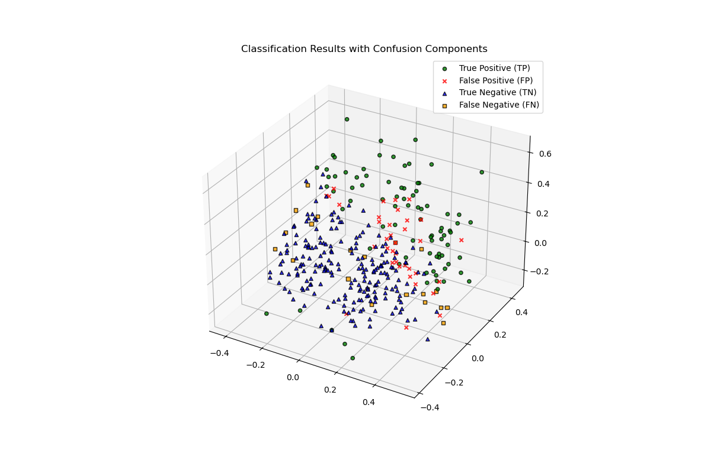

### sklearn
linear_sklearn = LinearRegression()

**TP: 78  TN: 217  FP: 20  FN: 24**
Accuracy: 0.8702064896755162
Precision: 0.7959183673469388
Recall: 0.7647058823529411
F1 Score: 0.7799999999999999
Total time taken: 5.636926174163818 seconds

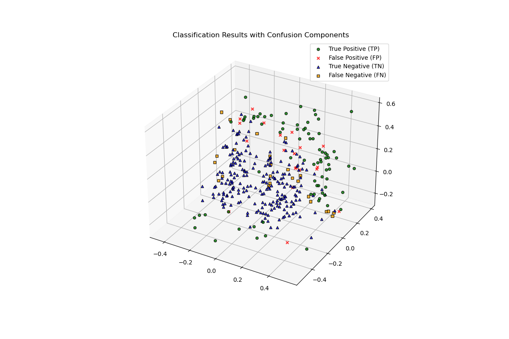

## perceptron
### my model
perceptron_model = Perceptron(n_iter=50000, lr=2e-3, batch_size=64)

**TP: 102  TN: 242  FP: 44  FN: 21**
Accuracy: 0.8410757946210269
Precision: 0.6986301369863014
Recall: 0.8292682926829268
F1 Score: 0.758364312267658
Total time taken: 19.484343767166138 seconds

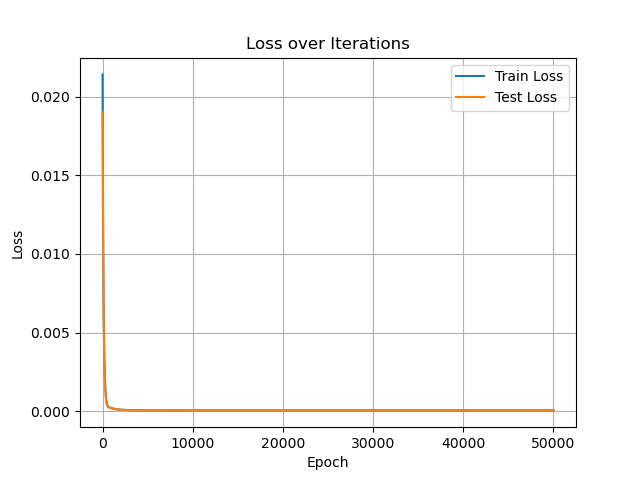 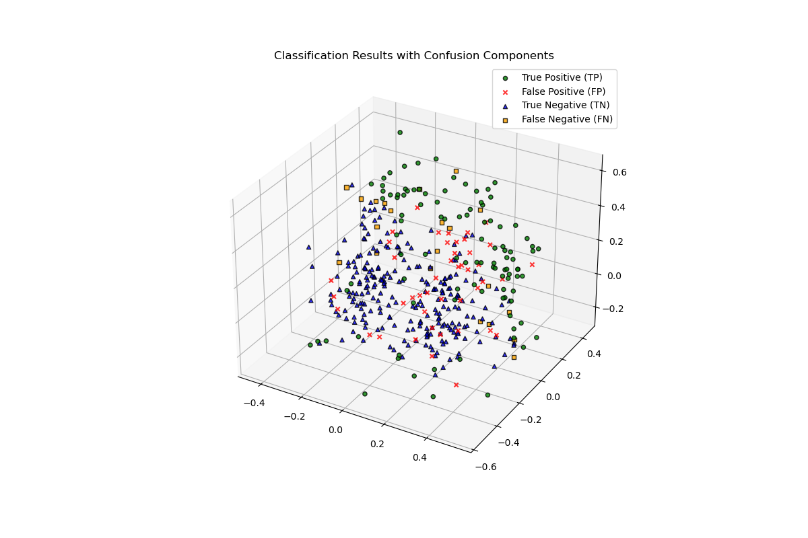

### sklearn
perceptron_sklearn = Perceptron(max_iter=100000, random_state=42)

**TP: 94  TN: 232  FP: 36  FN: 21**
Accuracy: 0.8511749347258486
Precision: 0.7230769230769231
Recall: 0.8173913043478261
F1 Score: 0.7673469387755102
Total time taken: 2.7166144847869873 seconds

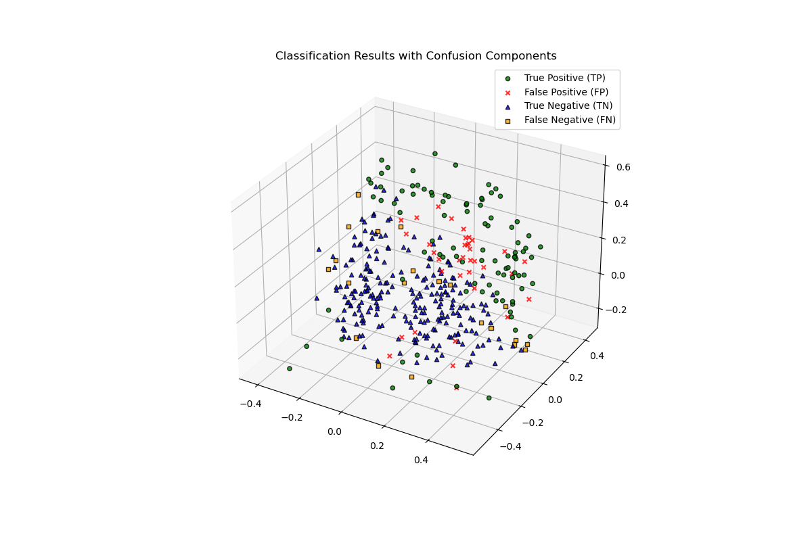

## logistic regression
### my model
logistic_model = LogisticRegression(n_iter=30000, lr=3e-3, batch_size=64)

**TP: 85  TN: 195  FP: 52  FN: 21**
Accuracy: 0.7932011331444759
Precision: 0.6204379562043796
Recall: 0.8018867924528302
F1 Score: 0.6995884773662552
Total time taken: 19.374540090560913 seconds

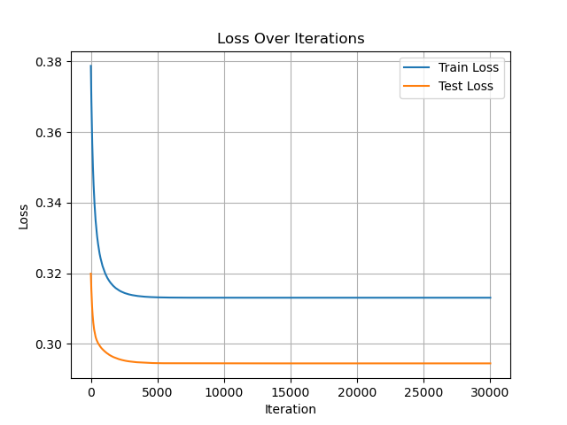 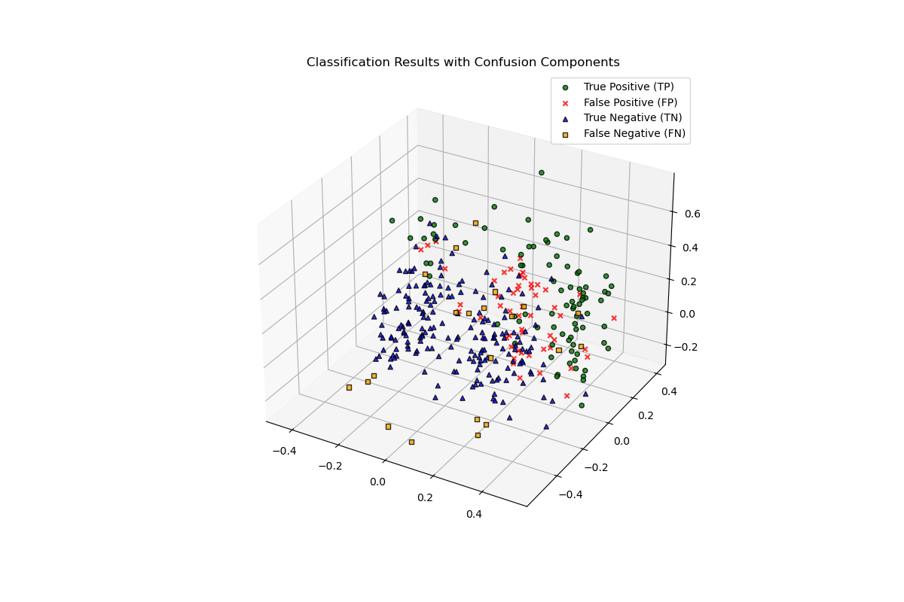

### sklearn
logistic_sklearn = LogisticRegression(max_iter=100000, random_state=42)

**TP: 61  TN: 165  FP: 26  FN: 21**
Accuracy: 0.8278388278388278
Precision: 0.7011494252873564
Recall: 0.7439024390243902
F1 Score: 0.7218934911242605
Total time taken: 2.442545175552368 seconds

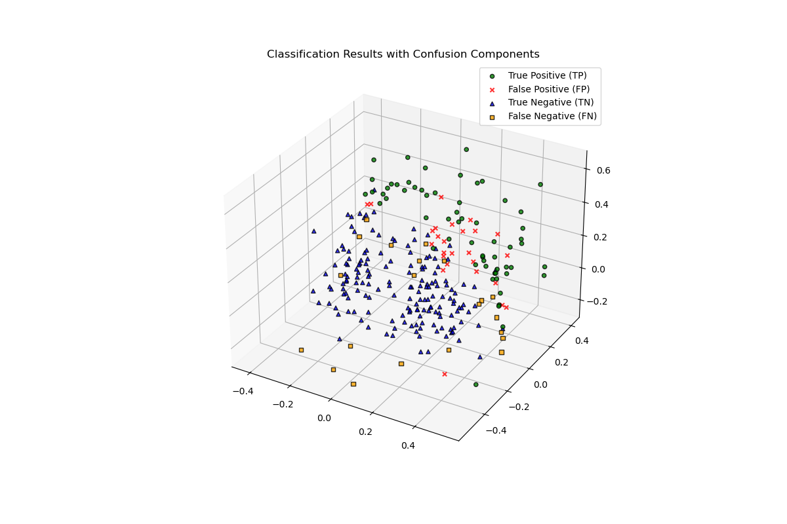

## MLP
### my model
mlp_model = MultiLayerPerceptron(layer_sizes=[X_train.shape[1],47,101,32], n_iter=10000, lr=1e-5, batch_size=32)

**TP: 87  TN: 213  FP: 20  FN: 13**
Accuracy: 0.9009009009009009
Precision: 0.8130841121495327
Recall: 0.87
F1 Score: 0.8405797101449274
Total time taken: 421.797244310379 seconds

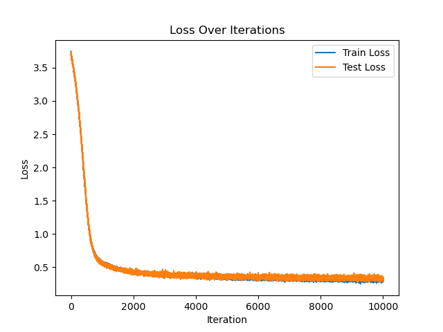 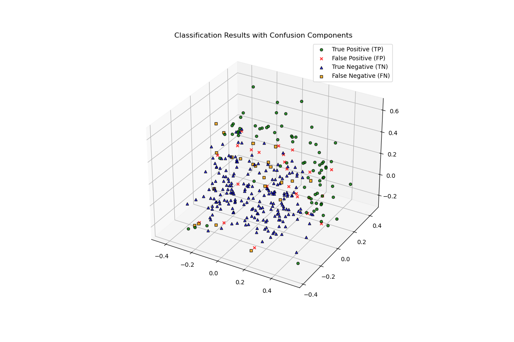

### sklearn
mlp_sklearn = MLPClassifier(hidden_layer_sizes=(12,47,101,11), activation='relu', solver='adam', max_iter=10000, random_state=42)

**TP: 90  TN: 213  FP: 15  FN: 8**
Accuracy: 0.9294478527607362
Precision: 0.8571428571428571
Recall: 0.9183673469387755
F1 Score: 0.8866995073891625
Total time taken: 8.705824136734009 seconds

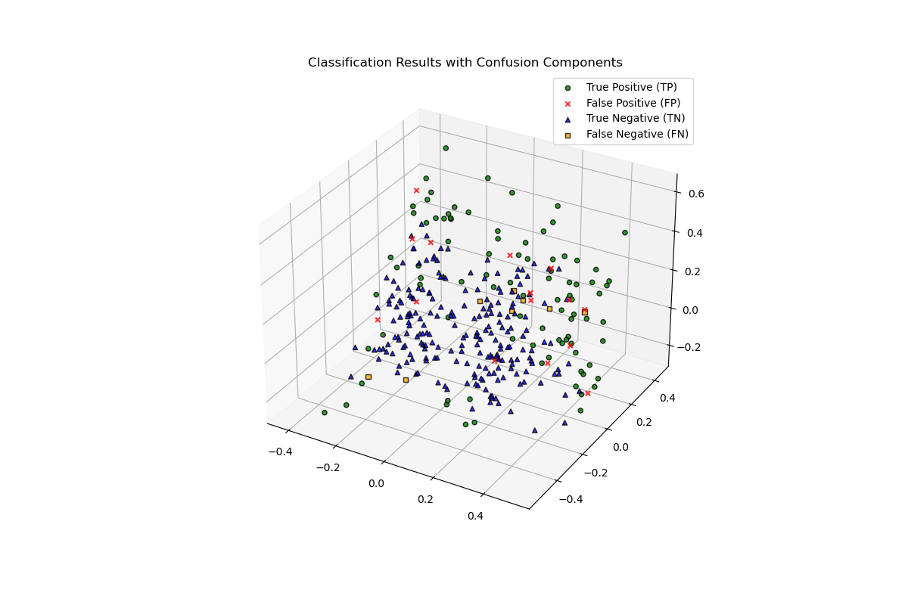
