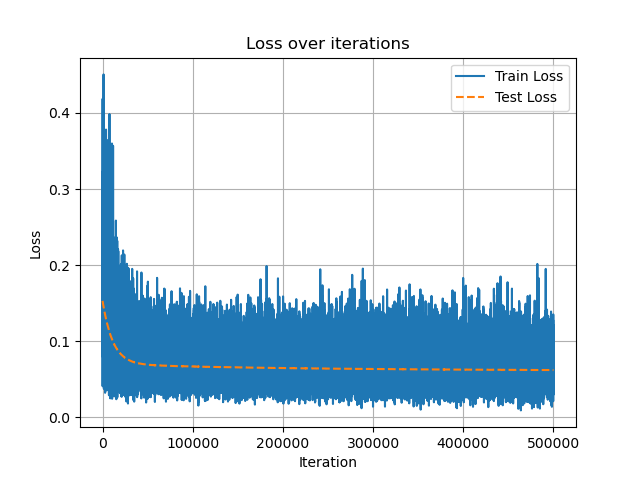

## linear regression
### my model
linear_model = LinearRegression(n_iter=50000, lr=9e-4, batch_size=64)
linear_model.train(X_train, Y_train, X_test, Y_test)
linear_model.plot_loss()
evaluate_model(linear_model, X_test, Y_test)
plot_confusion_results(linear_model, X_test, Y_test)

**TP: 83  TN: 206  FP: 36  FN: 21**
Accuracy: 0.8352601156069365
Precision: 0.6974789915966386
Recall: 0.7980769230769231
F1 Score: 0.7443946188340808
Total time taken: 38.09750461578369 seconds

{ width=45% } { width=45% }
